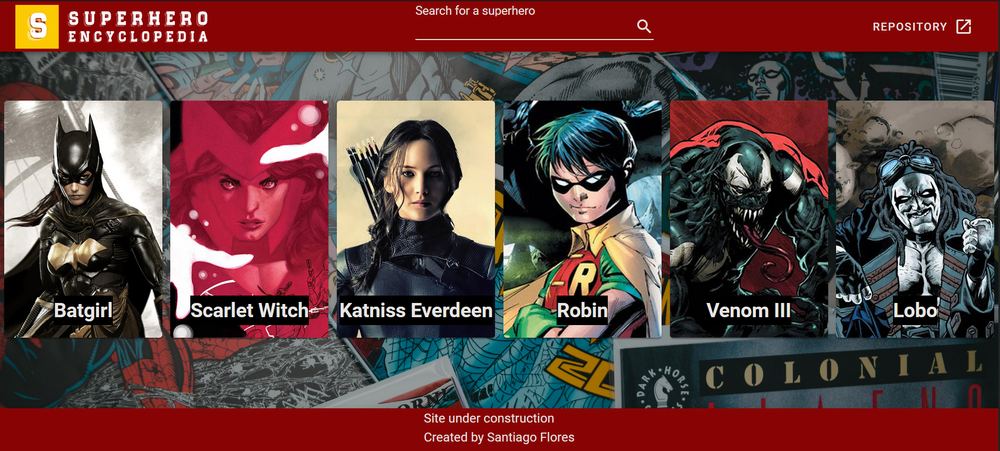
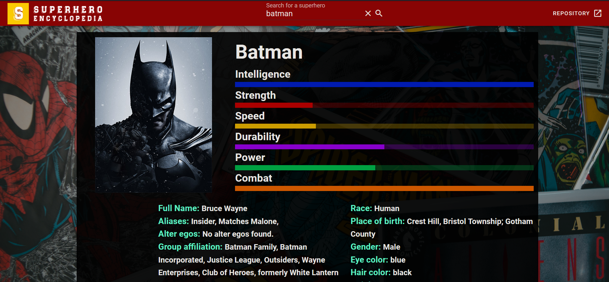

# Superhero Encyclopedia

An application to see some of the most popular superheros, with an image, their stats and some of their history.

Built with VueJs and Typescript

## Project status

This project is currently in development. For questions, suggestions and requests please email santiagof.dev@gmail.com or create an issue in the repository.

## Project screenshots




## Resources

Information fetched from [superhero-api](https://akabab.github.io/superhero-api/api/)
## Project setup

Clone down this repository. You will need `node` and `npm` installed globally on your machine.

### Installation:
```
npm install
```

### Compiles and hot-reloads for development
```
npm run serve
```

### Local App URL
```
http://localhost:8080/
```

## Contact

Santiago Flores

santiagof.dev@gmail.com

[GitHub](https://github.com/santiagofloresm)

[LinkedIn](https://www.linkedin.com/in/sfloresmeza/)